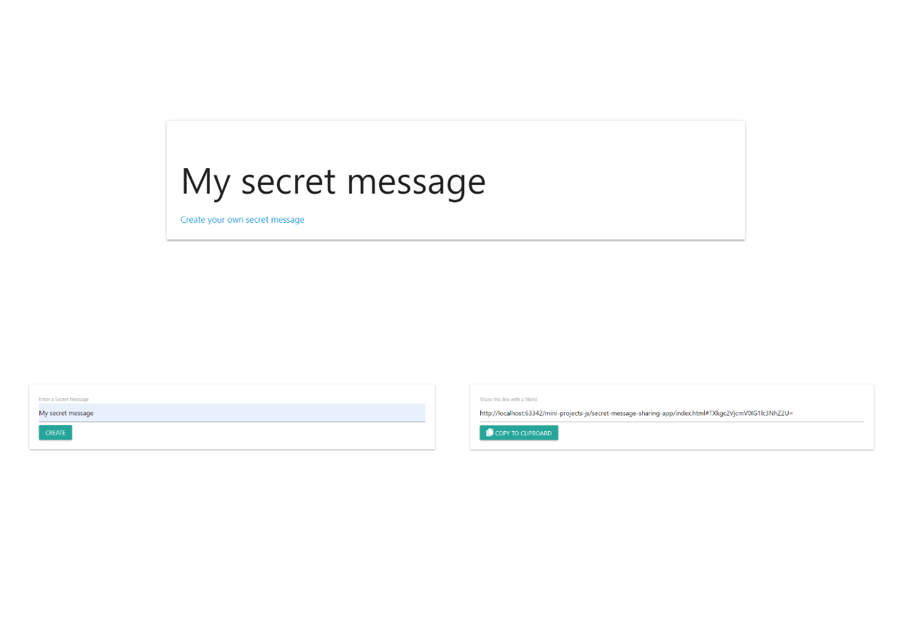

# Repository content
#### Application Movie Fight
> - User is going to search for two different movies. Application fetch information about chosen movies and make comparison statistics indicators.  
> - For styling used Bulma css framework. 
>
>[Deployment](https://nadyashvedko.github.io/mini-projects-js/movie-fight/)
#### Secret message sharing app
> - The user enters his message into the input.
> - The "Create" button generates the link. The link can be shared with a friend.  
> - By clicking on the link the friend will see the "Secret message".   
> - For styling used Materialize library. 
>
>[Deployment](https://serene-poincare-3c6b2b.netlify.app/)